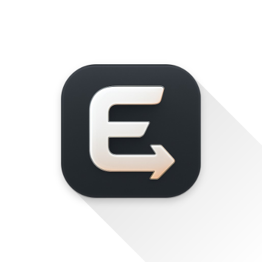
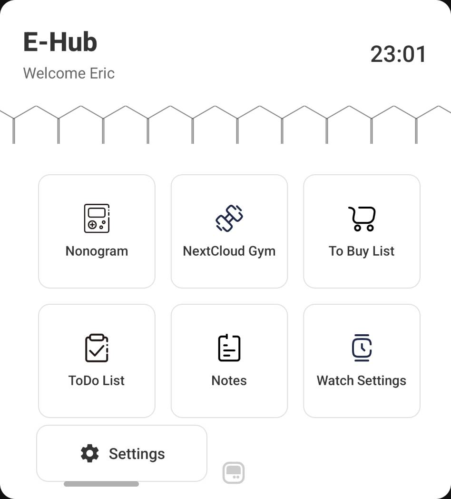
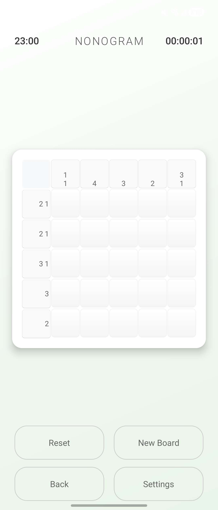
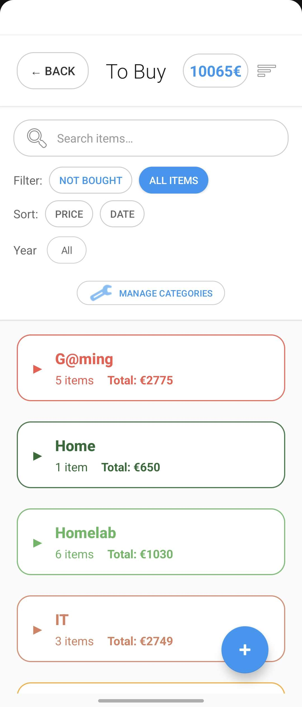
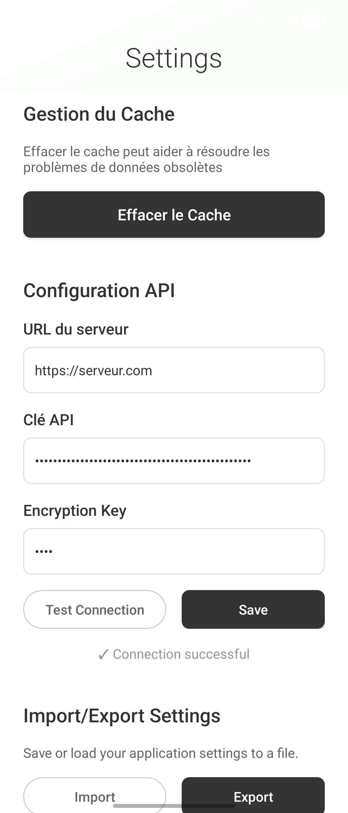
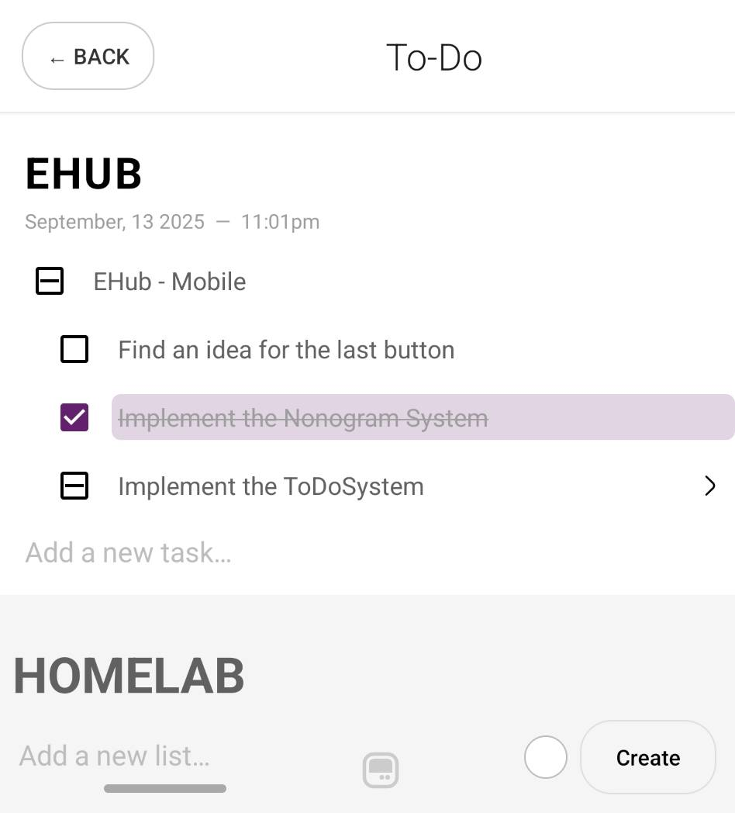
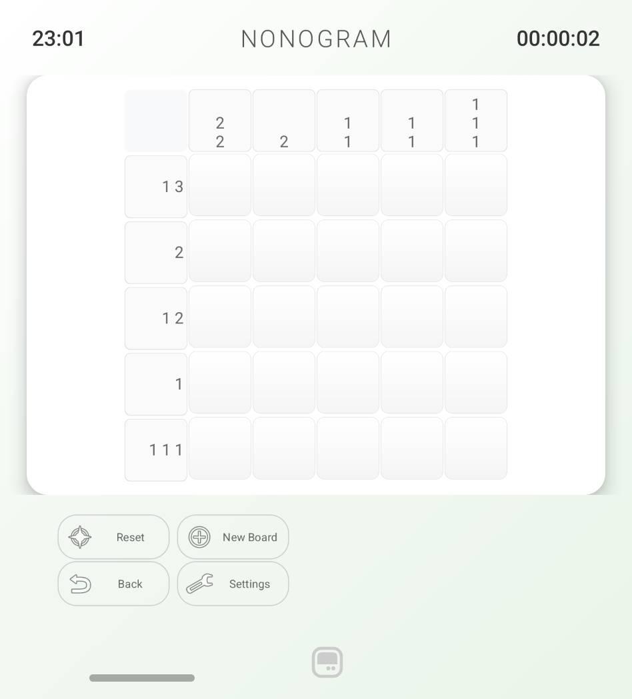

  

# E-Hub Mobile Application

E-Hub is a project designed to create tools and services that simplify and improve my daily life.
Its goals are twofold:

1. To explore and experiment with a wide range of technologies, gaining hands-on experience and learning new skills.
2. To make the platform accessible across multiple environments and devices:
   - [x] [Web Server](https://github.com/Eric-Philippe/E-Hub-Server) - v1.0.0 released
   - [x] [Grafana Dashboards](https://github.com/Eric-Philippe/E-Hub-Server/tree/main/grafana)
   - [x] [Mobile application (Android)](https://github.com/Eric-Philippe/E-Hub-Mobile) - v1.0.0 released
   - [ ] Samsung Tizen application (Next)
   - [ ] Desktop application
     - [ ] MacOS
     - [ ] Windows
     - [ ] Linux
   - [ ] Android TV application
   - [ ] Receipt printer

---

This repository contains the code for the mobile application. The application is built using Kotlin and the Android SDK.

> I've developed this application specifically on my own Samsung Galaxy ZFlip 7, and made it compatible with the main screen but also the external screen.

## Features

- Nonogram puzzle game
- ToBuy shopping list
- ToDo fancy monochrome list
- Quick notes
- NextCloud WebDav synchronization
- Smartwatch configuration (coming soon)

## Nonogram Puzzle Game

The Nonogram puzzle game generates puzzles and lets you solve them. You can toggle the haptic feedback, and the timer if you want to challenge yourself.

## ToDo list

I had enough of ToDo lists that were not made for me. So I created my own, with a simple monochrome design. The ToDo entity has the feature to contain sub-tasks.

## ToBuy shopping list

The ToBuy shopping list allows you to create a listing of items you'd like to buy, storing them by categories.
Add links to your items to quickly access them when you're in the store.

## Quick Notes

The Quick Notes section allows you to jot down notes quickly, without any formatting. Just type down your thoughts and ideas, the auto-save feature will take care of the rest.

All the notes are stored in an encrypted format in the database using a local key to encode/decode when reading/writing.

## NextCloud WebDav synchronization

I had a lot of gym photos that I wanted to move from my phone to my NextCloud server. So I added a feature to the app to allow you to configure a WebDav connection to your NextCloud server, and upload files directly from the app.

## Settings

I wanted a simple minimalist settings page, allowing to configure the connection to the API server and import/export your settings easily.

## Technologies Used

- **Kotlin** (primary language)
- **Android SDK**
- **Encrypted local storage** (for notes)
- **WebDAV** (NextCloud sync)
- **JSON** (local storage format)
- **Haptic feedback** (game UX)
- **Caching** (local data persistence)
- **Coroutines** (asynchronous operations)
- **MVVM architecture**
- **Material Design**
- **Multi-screen support** (main/external screen)

## Illustrations

  
  
  

## Versioning

For transparency and to maintain a clear history of changes, this project uses [Semantic Versioning](https://semver.org/).

Current version: **1.0.0**

## License

This project is licensed under the MIT License - see the [LICENSE](LICENSE.md) file for details.
